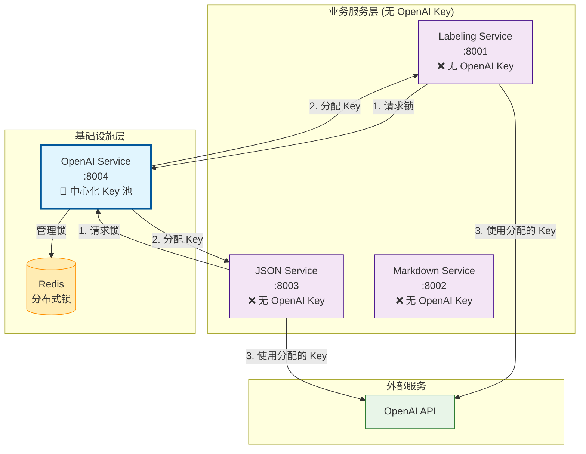

# OpenAI Service 架构设计

## 🎯 核心设计原则

### **OpenAI Service = 中心化 API Key 管理器**



## 🔑 API Key 管理策略

### ✅ **正确的架构**

| 服务 | OpenAI API Key | 获取方式 | 职责 |
|------|----------------|----------|------|
| **OpenAI Service** | ✅ **管理完整的 Key 池** | 环境变量配置 | 🔑 中心化 Key 分发<br/>🔐 分布式锁管理<br/>📊 使用统计 |
| **Labeling Service** | ❌ **无 Key** | 通过锁机制动态获取 | 🏷️ 文本标签分析 |
| **JSON Service** | ❌ **无 Key** | 通过锁机制动态获取 | 📝 MD → JSON 转换 |
| **Markdown Service** | ❌ **无 Key** | 不需要 OpenAI | 📄 文档 → MD 转换 |

### ❌ **错误的架构（避免）**

```
每个服务都配置 OpenAI Key → 导致:
- 🔴 Key 分散管理，难以控制
- 🔴 无法统一限流和监控  
- 🔴 安全风险：Key 暴露在多个服务
- 🔴 资源浪费：重复的 Key 配置
```

## 🔄 完整的调用流程

### 1. **Lock Acquisition（锁获取）**
```http
labeling-service → openai-service
POST /v1/lock/acquire
{
  "service_name": "labeling-service",
  "dimension": "c_role",
  "content_type": "candidate",
  "estimated_duration": 300
}

Response:
{
  "success": true,
  "lock_info": {
    "lock_id": "abc123",
    "api_key": "sk-distributed-key-from-pool",  # 从池中分配
    "acquired_at": "2024-07-28T10:00:00Z",
    "expires_at": "2024-07-28T10:05:00Z"
  }
}
```

### 2. **Business Logic（业务处理）**
```python
# labeling-service 内部
config = get_autolabel_config(
    api_key=lock_info.api_key  # 使用从 openai-service 获得的 Key
)
result = autolabel_agent.run(dataset, config)  # 调用 OpenAI API
```

### 3. **Lock Release（锁释放）**
```http
labeling-service → openai-service  
POST /v1/lock/release
{
  "lock_id": "abc123",
  "usage_stats": {
    "success": true,
    "tokens_used": 150,
    "actual_duration": 280
  }
}
```

## 🏗️ 配置指南

### OpenAI Service 配置

```bash
# openai-service/.env
PRIMARY_OPENAI_API_KEY=sk-primary-key-here
OPENAI_API_KEYS=sk-key1,sk-key2,sk-key3  # 可选的额外 Key
REDIS_URL=redis://localhost:6379
DEV_MODE=false
```

### 其他服务配置

```bash
# labeling-service/.env
DEV_MODE=false  # 🔴 重要：关闭开发模式
OPENAI_SERVICE_URL=http://localhost:8004
# ❌ 不需要：OPENAI_API_KEY=...

# json-service/.env  
DEV_MODE=false  # 🔴 重要：关闭开发模式
OPENAI_SERVICE_URL=http://localhost:8004
# ❌ 不需要：OPENAI_API_KEY=...
```

## 🎯 开发模式 vs 生产模式

### 开发模式（DEV_MODE=true）

**仅用于快速开发和测试**，不需要 Redis 和 OpenAI Service：

```bash
# labeling-service/.env (开发模式)
DEV_MODE=true
OPENAI_API_KEY=sk-dev-key-here  # 临时开发用
```

### 生产模式（DEV_MODE=false）

**标准的分布式架构**，必须通过 OpenAI Service：

```bash
# labeling-service/.env (生产模式)
DEV_MODE=false
OPENAI_SERVICE_URL=http://openai-service:8004
# 不需要 OPENAI_API_KEY
```

## 💡 设计优势

### 1. **安全性**
- 🔐 OpenAI Key 集中存储，减少暴露面
- 🔑 其他服务无需持久化存储敏感信息
- 🛡️ 统一的访问控制和审计

### 2. **可维护性**  
- 🎯 单一 Key 管理点
- 🔄 支持 Key 轮换和健康检查
- 📊 集中的使用统计和监控

### 3. **可扩展性**
- ⚖️ 自动负载均衡（多 Key 轮询）
- 🚦 统一限流和配额管理
- 📈 支持动态扩容（增加更多 Key）

### 4. **成本控制**
- 💰 精确的使用追踪和成本分摊
- 🎛️ 基于服务的配额控制
- 📉 避免 Key 浪费和重复计费

## 🚀 部署建议

### 1. **服务启动顺序**
```bash
1. Redis (依赖)
2. OpenAI Service (Key 管理器)
3. 业务服务 (labeling-service, json-service)
```

### 2. **健康检查**
```bash
# 验证 OpenAI Service Key 池状态
curl http://localhost:8004/health

# 验证业务服务能够获取锁
curl -X POST http://localhost:8001/v1/label \
  -d '{"dimension": "c_role", "content_type": "candidate", "input_text": "test"}'
```

### 3. **监控指标**
- `openai_service_active_locks` - 活跃锁数量
- `openai_service_key_pool_health` - Key 池健康状态  
- `openai_service_token_usage` - Token 使用统计

## ❓ 常见问题

### Q: 为什么不让每个服务都配置 OpenAI Key？
**A**: 分散管理导致安全风险、重复成本、无法统一监控。中心化管理是最佳实践。

### Q: 如果 OpenAI Service 挂了怎么办？
**A**: 
- 短期：业务服务会重试获取锁
- 长期：OpenAI Service 支持高可用部署（多实例 + Redis 集群）

### Q: 开发阶段可以跳过 OpenAI Service 吗？
**A**: 可以！设置 `DEV_MODE=true` 即可直接使用本地 API Key，便于快速开发。

### Q: 如何添加新的 OpenAI Key？
**A**: 更新 OpenAI Service 的 `OPENAI_API_KEYS` 环境变量，支持热重载。

---

**核心原则**: OpenAI Service 是系统中唯一的 OpenAI API Key 持有者和分发者 🔑 