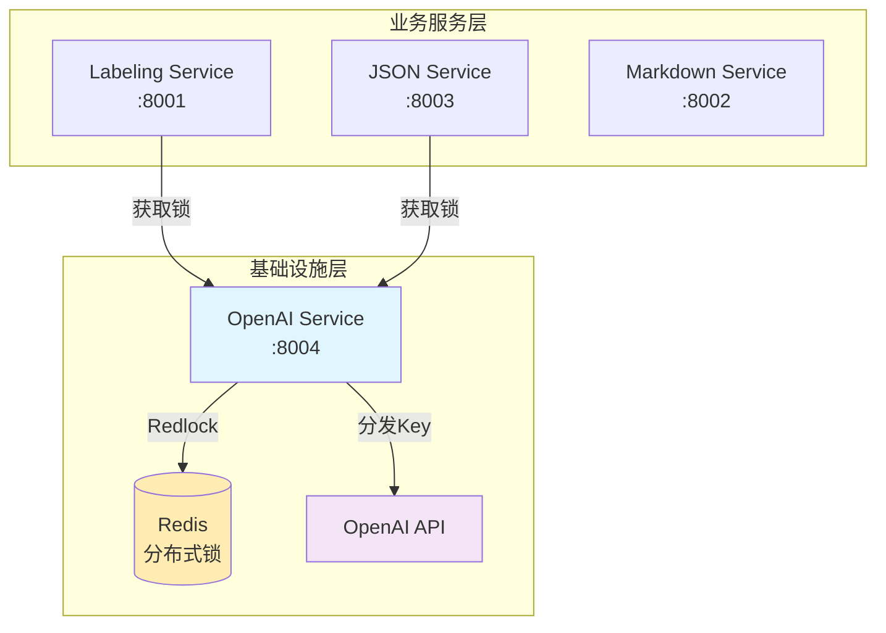

# OpenAI Service

**分布式锁管理与 API Key 编排服务** - 为 OpenAI API 访问提供统一的资源管理和分布式锁定机制。

## 🏗️ 架构概览

OpenAI Service 是微服务架构中的**基础设施层服务**，负责：

1. **分布式锁管理** - 使用 Redis Redlock 算法确保 OpenAI API 的安全访问
2. **API Key 池管理** - 统一管理和分发 OpenAI API 密钥
3. **使用统计追踪** - 记录和监控 API 使用情况
4. **健康检查与监控** - 提供服务状态和性能指标

### 服务依赖图



## ✨ 核心功能

### 🔐 分布式锁管理
- **Redis Redlock** 算法实现
- **自动过期** 和清理机制
- **并发安全** 的锁获取和释放
- **重试机制** 和故障恢复

### 🔑 API Key 管理
- **多密钥支持** - 配置多个 OpenAI API Key
- **负载均衡** - 轮询分配 API Key
- **健康检查** - 监控密钥状态
- **故障转移** - 自动切换到健康的密钥

### 📊 监控与统计
- **Prometheus 指标** - 锁获取时间、活跃锁数量等
- **使用统计** - 每个服务的调用次数、令牌消耗
- **结构化日志** - JSON 格式的详细日志
- **健康检查端点** - 服务状态监控

## 🚀 快速开始

### 前置要求

- **Python 3.8+**
- **Redis Server** (用于分布式锁)
- **OpenAI API Key** (至少一个)

### 1. 环境设置

```bash
# 克隆项目并进入目录
cd openai-service

# 创建虚拟环境
python3 -m venv openai-env
source openai-env/bin/activate  # Linux/Mac
# openai-env\Scripts\activate  # Windows

# 安装依赖
pip install -r requirements.txt
```

### 2. 配置环境变量

```bash
# 复制环境变量模板
cp env.example .env

# 编辑配置文件
vim .env
```

**关键配置项**：
```bash
# 必须配置
PRIMARY_OPENAI_API_KEY=sk-your-openai-api-key-here
REDIS_URL=redis://localhost:6379

# 开发模式
DEV_MODE=true
LOG_LEVEL=DEBUG
```

### 3. 启动服务

```bash
# 开发模式启动
python3 dev_start.py

# 或直接使用 uvicorn
uvicorn openai_service.main:app --host 0.0.0.0 --port 8004 --reload
```

### 4. 验证服务

```bash
# 健康检查
curl http://localhost:8004/health

# 服务信息
curl http://localhost:8004/system/info \
  -H "Authorization: Bearer dev-token"

# API 文档
open http://localhost:8004/docs
```

## 📝 API 接口

### 🔒 锁管理接口

#### 获取锁
```http
POST /v1/lock/acquire
Authorization: Bearer dev-token
Content-Type: application/json

{
  "service_name": "labeling-service",
  "resource_type": "openai_api",
  "dimension": "c_role",
  "content_type": "candidate",
  "estimated_duration": 300,
  "request_id": "uuid-here"
}
```

**响应**：
```json
{
  "success": true,
  "lock_info": {
    "lock_id": "abc123",
    "api_key": "sk-...",
    "acquired_at": "2024-07-28T10:00:00Z",
    "expires_at": "2024-07-28T10:05:00Z",
    "request_id": "uuid-here",
    "status": "acquired"
  },
  "timestamp": "2024-07-28T10:00:00Z"
}
```

#### 释放锁
```http
POST /v1/lock/release
Authorization: Bearer dev-token
Content-Type: application/json

{
  "lock_id": "abc123",
  "service_name": "labeling-service",
  "usage_stats": {
    "success": true,
    "actual_duration": 280,
    "tokens_used": 150,
    "error_message": null
  }
}
```

### 📊 监控接口

#### 健康检查
```http
GET /health
```

#### 活跃锁查询
```http
GET /v1/locks/active
Authorization: Bearer dev-token
```

#### Prometheus 指标
```http
GET /metrics
```

## 🔧 与现有服务集成

### 更新 labeling-service 配置

现在 `labeling-service` 可以切换到生产模式：

```bash
# labeling-service/.env
DEV_MODE=false
OPENAI_SERVICE_URL=http://localhost:8004
SERVICE_TOKEN=your-production-token
```

### 更新 json-service 配置

```bash
# json-service/.env  
DEV_MODE=false
OPENAI_SERVICE_URL=http://localhost:8004
SERVICE_TOKEN=your-production-token
```

### 测试集成

```bash
# 测试 labeling-service 通过 openai-service 获取锁
curl -X POST http://localhost:8001/v1/label \
  -H "Content-Type: application/json" \
  -d '{
    "dimension": "c_role",
    "content_type": "candidate", 
    "input_text": "Senior Software Engineer"
  }'

# 测试 json-service 通过 openai-service 获取锁
curl -X POST http://localhost:8003/v1/to-json \
  -H "Content-Type: application/json" \
  -H "X-Service-Token: dev-token" \
  -d '{
    "markdown_content": "# John Doe\nSoftware Engineer",
    "template": "resume_template"
  }'
```

## 🏭 生产环境部署

### 1. Redis 集群配置

```bash
# 生产环境建议使用 Redis 集群
REDIS_URL=redis://redis-cluster:6379
REDIS_PASSWORD=your-redis-password
```

### 2. 多 API Key 配置

```bash
PRIMARY_OPENAI_API_KEY=sk-primary-key
OPENAI_API_KEYS=sk-key1,sk-key2,sk-key3
```

### 3. 安全配置

```bash
DEV_MODE=false
SERVICE_TOKEN=complex-production-token
LOG_LEVEL=INFO
```

### 4. Docker 部署

```dockerfile
FROM python:3.11-slim

WORKDIR /app
COPY requirements.txt .
RUN pip install -r requirements.txt

COPY src/ ./src/
COPY .env .

EXPOSE 8004
CMD ["python", "-m", "uvicorn", "openai_service.main:app", "--host", "0.0.0.0", "--port", "8004"]
```

## 📊 监控与运维

### Prometheus 指标

- `openai_service_requests_total` - 请求总数
- `openai_service_request_duration_seconds` - 请求处理时间
- `openai_service_active_locks` - 活跃锁数量
- `openai_service_lock_acquisition_duration_seconds` - 锁获取时间

### 日志监控

所有日志采用结构化 JSON 格式：

```json
{
  "timestamp": "2024-07-28T10:00:00Z",
  "level": "info",
  "event": "Lock acquired successfully",
  "lock_id": "abc123",
  "service_name": "labeling-service",
  "processing_time_ms": 45.2
}
```

### 运维端点

```bash
# 强制释放锁（管理员操作）
curl -X DELETE http://localhost:8004/v1/locks/{lock_id}/force-release \
  -H "Authorization: Bearer admin-token"

# 清理过期锁
curl -X POST http://localhost:8004/v1/maintenance/cleanup-expired \
  -H "Authorization: Bearer admin-token"
```

## 🏗️ 架构设计原则

### 1. **单一职责**
- 专注于分布式锁和 API Key 管理
- 不涉及业务逻辑，只提供基础设施服务

### 2. **高可用性**
- Redis Redlock 算法确保分布式环境下的锁安全
- 多 API Key 支持和故障转移机制
- 自动清理过期锁

### 3. **可观测性**
- 完整的 Prometheus 指标
- 结构化日志
- 健康检查端点

### 4. **向前兼容**
- 为 Orchestrator 预留优先级队列接口
- 支持多种上下文信息（dimension、template 等）

## 🎯 后续规划

1. **优先级队列** - 为 Orchestrator 提供基于优先级的锁分配
2. **多 Redis 实例** - 真正的 Redlock 集群部署
3. **API Key 健康监控** - 实时监控 API Key 状态和限流
4. **使用配额管理** - 基于服务的使用配额和限制

## 🤝 贡献指南

1. 遵循现有的代码风格和架构模式
2. 添加适当的日志和指标
3. 编写单元测试和集成测试
4. 更新相关文档

---

**OpenAI Service v1.0.0** - 为微服务架构提供可靠的分布式锁和 API Key 管理 🚀 